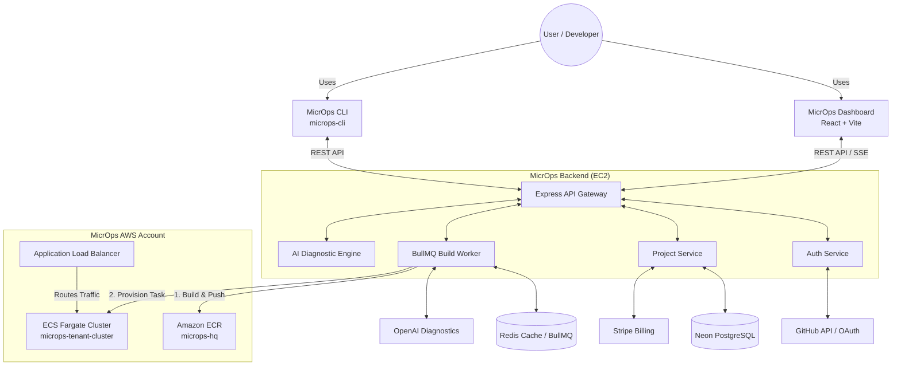

#  MicrOps — Autonomous No-Code Cloud DevOps & Serverless Container Orchestrator

[](http://13.238.226.195)
[](https://aws.amazon.com/)
[](https://nodejs.org/)
[](https://vitejs.dev/)

**MicrOps** (`microps.in`) is an enterprise-grade, autonomous No-Code DevOps platform engineered to eliminate manual cloud engineering overhead. By simply pasting any Git repository URL, MicrOps performs deep AI-driven pre-flight repository inspection, constructs resilient OCI container images via isolated worker queues, streams real-time build telemetry, and deploys zero-downtime microservices directly onto AWS ECS Fargate serverless clusters.

---

## 🌐 Live Production Deployment

MicrOps is live on AWS in the **Sydney (`ap-southeast-2`)** region running under a highly cost-optimized, secure hybrid cloud architecture:
- **Live Production Domain**: [http://microps.in](http://microps.in) (Direct A-Record resolution)
- **Elastic IP Host**: [http://13.238.226.195](http://13.238.226.195)
- **API Gateway Endpoint**: `http://13.238.226.195/api/v1/`
- **Dual Reverse Proxy Engine**: Nginx reverse proxy serving static React SPA artifacts from `/var/www/microps-frontend` and proxying `/api/` requests directly to underlying Node.js PM2 daemons on port `8000`. Synchronized continuously with Amazon S3 (`microps-client`) via automated GitHub Actions CI/CD (`deploy-frontend.yml`).

---

## ✨ Key Platform Features

### 🎨 1. Obsidian & Gold Enterprise Design System
- **Curated Visual Palette**: Engineered around strict Obsidian Deep (`#050505`), Gold (`#C9982D`), and Ivory (`#F6F4EF`) design tokens with consistent 8-point spatial hierarchy.
- **Decomposed 9-Stage Deployment Control Center**: Modular architecture separating deployment configuration from live operational telemetry (`DeployHeader`, `RepoInput`, `ConfigPanel`, `PreflightResults`, `PipelineView`, `LogConsole`, `DiagnosticBanner`, `InfraTimeline`, `HealthSummary`).
- **Streamlined Operator Navigation**: 5-tab clean workspace navigation (Overview, Projects, Deployments, Billing, Settings) with real-time incident alert banners.

### 📡 2. Automated Pre-Flight Intelligence & Cost Oracle
- **Radar Scanning**: Automatically clones and audits target GitHub repositories to detect programming language runtimes (Node.js, Python, Go, Java) and frameworks (Next.js, Vite, Django, Flask).
- **Cost Forecasting**: Computes real-time AWS infrastructure cost projections and assigns optimal CPU/Memory serverless specifications before build execution.

### ⚡ 3. Real-Time Telemetry & Autonomous AI Remediation
- **Server-Sent Events (`EventSource`)**: Streams live terminal logs directly from remote container build engines into the user's web dashboard with millisecond precision.
- **Autonomous One-Click Fix Engine**: AI diagnostic engine inspects container build failures (e.g., missing dependencies, OOM errors), displays heuristic confidence scores, and applies one-click automated fixes directly to pipeline configuration (`POST /api/v1/build/apply-fix`).

### 🐳 4. Autonomous Container Buildpacks & ECR Registry
- **Auto-Healing Dockerfiles**: Inspects repository structures and automatically generates standardized, multi-stage production Dockerfiles if none exist.
- **Resilient Packaging**: Automatically patches fragile dependency commands (e.g., converting `npm ci` to `npm install --legacy-peer-deps`) to guarantee deterministic container generation.
- **Automated OCI Registry Push**: Logs into AWS ECR (`microps-hq`), tags builds with unique tenant identifiers (`tenant-<userId>-<projectName>-<jobId>`), and pushes verified images.

### ☁️ 5. Serverless ECS Fargate Deployment
- **Zero Idle Infrastructure**: Provisions dedicated AWS ECS Fargate serverless tasks on demand within `microps-tenant-cluster`.
- **Health Checks & ALB Attachment**: Seamlessly attaches active containers to AWS Application Load Balancer target groups (`microps-platform-backend-tg`) for production traffic routing.

### 🔐 6. Bring Your Own Cloud (BYOC) via OIDC
- **Zero-Trust Architecture**: Deploy directly to your own AWS account without sharing AWS access keys.
- **GitHub Actions Integration**: MicrOps automatically injects a bespoke GitHub Actions workflow into your repository using secure `sts:AssumeRoleWithWebIdentity` OIDC flows.

### 💻 7. MicrOps CLI (`microps-cli`)
- **Native Terminal Experience**: Interact with your infrastructure directly from your IDE. Run `npm i -g microps-cli` to use `microps login`, `microps projects`, and `microps link` to rapidly connect and bind microservices to your AWS environment.

---

## 🏛️ System Architecture Overview



---

## 📁 Repository & Directory Structure

```
microps/production/
├── README.md                    # Primary project specification (This Document)
├── AWS_ARCHITECTURE.md          # Exhaustive AWS infrastructure & topology guide
├── LOCAL_ARCHITECTURE.md        # Code structure, data flow & class diagrams
├── TECH_STACK_SERVICES.md       # Specification of frameworks, tools & cloud services
├── ERRORS_LOGS.md               # Chronological debugging log & terminal command history
├── DEPLOYMENT_ROADMAP.md        # Step-by-step production rollout & verification checklist
├── backend/                     # Node.js / Express 4 / TypeScript Backend API
│   ├── src/
│   │   ├── app.ts               # Express configuration, security headers & routing
│   │   ├── server.ts            # Port 8000 entrypoint listener
│   │   ├── controllers/         # Auth, Preflight, Projects, Build & Billing controllers
│   │   ├── services/            # Core business engines (Preflight, Builder, ECS Deploy)
│   │   ├── repository/          # Postgres database access (`pg` pool)
│   │   └── utils/               # Event bus, AES-GCM encryption utilities
│   └── package.json
└── frontend/                    # React 18 / Vite 6 / Tailwind CSS SPA Dashboard
    ├── src/
    │   ├── components/
    │   │   ├── dashboard/       # OverviewSection & DeploymentControlCenter orchestrator
    │   │   ├── deploy/          # 9 decomposed deployment sub-components (LogConsole, ConfigPanel, etc.)
    │   │   ├── landing/         # HeroSection, Plasma & high-converting landing components
    │   │   ├── settings/        # SettingsSection with operator identity & security policy
    │   │   ├── billing/         # BillingSection, tier grids & invoice ledger
    │   │   └── ui/              # Design system primitives (Card, StatCard, StatusBadge, ShinyText)
    │   ├── pages/               # Application views (Dashboard, Login, Signup)
    │   ├── lib/api.ts           # Dynamic HTTP client & JWT Bearer interceptor
    │   └── store/               # Zustand state stores
    └── package.json
```

---

## 🚀 Quickstart & Setup Guide

### 1. Local Development Setup
Prerequisites: Node.js 20+, Docker (for Redis), PostgreSQL.

```bash
# 1. Clone repository
git clone https://github.com/codesbysaravana/Microps.git
cd Microps/production

# 2. Start local Redis instance via Docker
docker run -d --name microps-redis -p 6379:6379 redis:latest

# 3. Install dependencies and run both Backend & Frontend concurrently
npm run install:all
npm run dev
```

### 2. Production AWS Deployment Verification
To test live deployment pipelines against the production Elastic IP:
```bash
# Execute integration test against live platform
node -e "
const http = require('http');
async function runTest() {
  const email = 'test_' + Date.now() + '@microps.in';
  await fetch('http://13.238.226.195/api/v1/auth/signup', {
    method: 'POST',
    headers: { 'Content-Type': 'application/json' },
    body: JSON.stringify({ email, password: 'Password123!', name: 'Test User' })
  });
  const loginRes = await fetch('http://13.238.226.195/api/v1/auth/login', {
    method: 'POST',
    headers: { 'Content-Type': 'application/json' },
    body: JSON.stringify({ email, password: 'Password123!' })
  });
  const token = (await loginRes.json()).data.token;
  
  http.get('http://13.238.226.195/api/v1/build/stream?token=' + token, (res) => {
    res.on('data', (c) => console.log('>>> SSE:', c.toString().trim()));
  });

  setTimeout(async () => {
    await fetch('http://13.238.226.195/api/v1/build/deploy', {
      method: 'POST',
      headers: { 'Content-Type': 'application/json', 'Authorization': 'Bearer ' + token },
      body: JSON.stringify({
        repoUrl: 'https://github.com/codesbysaravana/portfolio',
        branch: 'main',
        buildCommand: 'npm run build',
        projectName: 'portfolio'
      })
    });
  }, 2000);
}
runTest();
"
```

---

## 📚 Documentation Ecosystem

Refer to the following specialized documentation files for deep technical specifications:
- **[AWS Architecture Specification](file:///c:/Users/csara/Downloads/java-backend-mrcooper/microps/production/AWS_ARCHITECTURE.md)**: Cloud network topology, VPC subnets, security groups, IAM least privilege, and Nginx reverse proxy architecture.
- **[Local Architecture Specification](file:///c:/Users/csara/Downloads/java-backend-mrcooper/microps/production/LOCAL_ARCHITECTURE.md)**: Class diagrams, data flow lifecycles, and environment variable references.
- **[Tech Stack & Cloud Services Specification](file:///c:/Users/csara/Downloads/java-backend-mrcooper/microps/production/TECH_STACK_SERVICES.md)**: Detailed breakdown of frontend/backend packages, libraries, AWS services, and DevOps tooling.
- **[Error & Debugging Command Log](file:///c:/Users/csara/Downloads/java-backend-mrcooper/microps/production/ERRORS_LOGS.md)**: Chronological error logs, root cause analysis, and exact terminal commands used during live debugging.
- **[Deployment Roadmap](file:///c:/Users/csara/Downloads/java-backend-mrcooper/microps/production/DEPLOYMENT_ROADMAP.md)**: Step-by-step production rollout plan and live verification status.

---
*Engineered with precision for autonomous cloud orchestration on AWS.*
