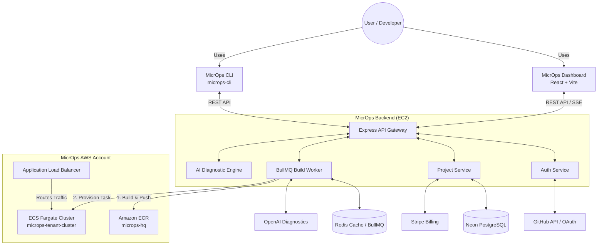
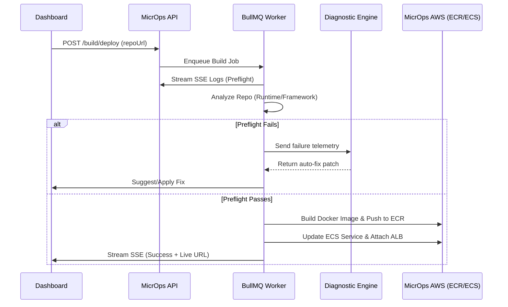
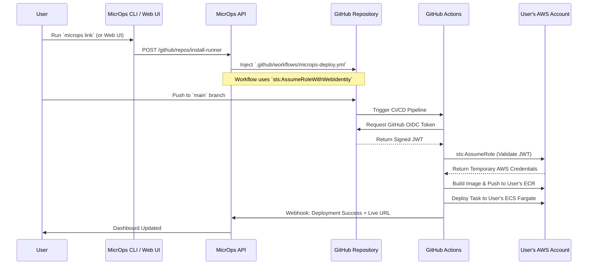
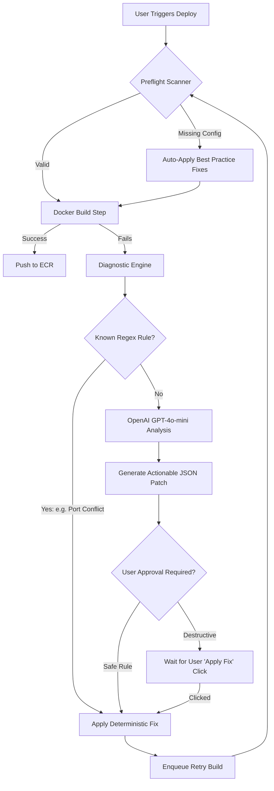

# MicrOps Current Architecture (v2)

This document outlines the most up-to-date architecture for the MicrOps platform, including the new **Bring Your Own Cloud (BYOC) OIDC** pipeline and the autonomous **AI Diagnostic Engine**.

---

## 1. High-Level System Topology

MicrOps acts as the central nervous system connecting the user's codebase (GitHub) to the cloud (AWS), providing both hosted deployments (MicrOps Native Cloud) and decentralized deployments (Bring Your Own Cloud).



---

## 2. Dual-Mode Deployment Architecture

MicrOps now supports two distinct deployment models: **Native Cloud** (hosted by MicrOps) and **BYOC** (deployed to the user's AWS account securely via OIDC).

### Mode A: MicrOps Native Deployment (BullMQ Worker)
This is the default flow when a user clicks "Deploy" in the dashboard. The entire build process is orchestrated internally by the MicrOps backend.



### Mode B: Bring Your Own Cloud (Zero-Trust OIDC)
This flow allows enterprise users to host their workloads on their own AWS infrastructure without ever sharing AWS Access Keys with MicrOps.



---

## 3. The AI Self-Healing Engine (v2)

MicrOps sets itself apart by actively repairing broken deployments instead of just reporting them.



---

## 4. Security & Network Isolation Boundary

```mermaid
graph LR
    subgraph External
        Internet((Public Internet))
        GitHubOIDC[GitHub OIDC Provider]
    end

    subgraph UserAWS ["User's AWS Account (BYOC)"]
        IAMRole[IAM Role for GitHub Actions]
        UserECR[Private ECR]
        UserECS[ECS Cluster]
        
        IAMRole -. trusts .-> GitHubOIDC
        IAMRole -->|Grants Access| UserECR
        IAMRole -->|Grants Access| UserECS
    end

    subgraph MicrOpsAWS ["MicrOps AWS Account (Native)"]
        Nginx[EC2 Nginx Proxy]
        NodeAPI[Node.js Backend]
        MicrOpsECR[Internal ECR]
        
        Internet -->|HTTPS :443| Nginx
        Nginx -->|Proxy :8000| NodeAPI
        NodeAPI -->|Builds| MicrOpsECR
    end

    %% The defining feature: No hardcoded credentials cross the boundary
    NodeAPI -.-x|NO DIRECT ACCESS| User AWS
```
